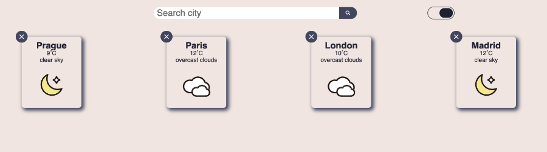
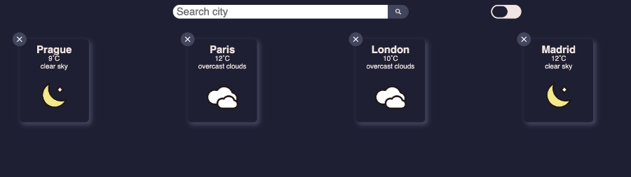

# Weather App

Weather app built to train how to consume an API. A weather API, as you may have guessed already.

## Screenshots

- **Light theme**

- **Dark theme**

## Description

This app works with [Openweathermap.org](https://openweathermap.org/). In particulatr with current weather data. 
App shows current weather for desired city. 
If no city has shown, you may have typo or, OpenWeatherMap does not have a data for your city.

## Tech/frameworks used

- React v17.0.2
- Styled Components v5.3.0

## Config

You have to put your API key to `.env` file as follows. 
`REACT_APP_API_KEY='YOUR_API_KEY'` 
You need *REACT_APP* prefix because this application does not use .env package.

## Run application

Clone this repo with `git clone`. 
After cloning run `npm install` to install all dependencies. 
At last, run `npm start` to run the application in the development mode. 
Open [http://localhost:300](http://localhost:3000) to view it in your browser.